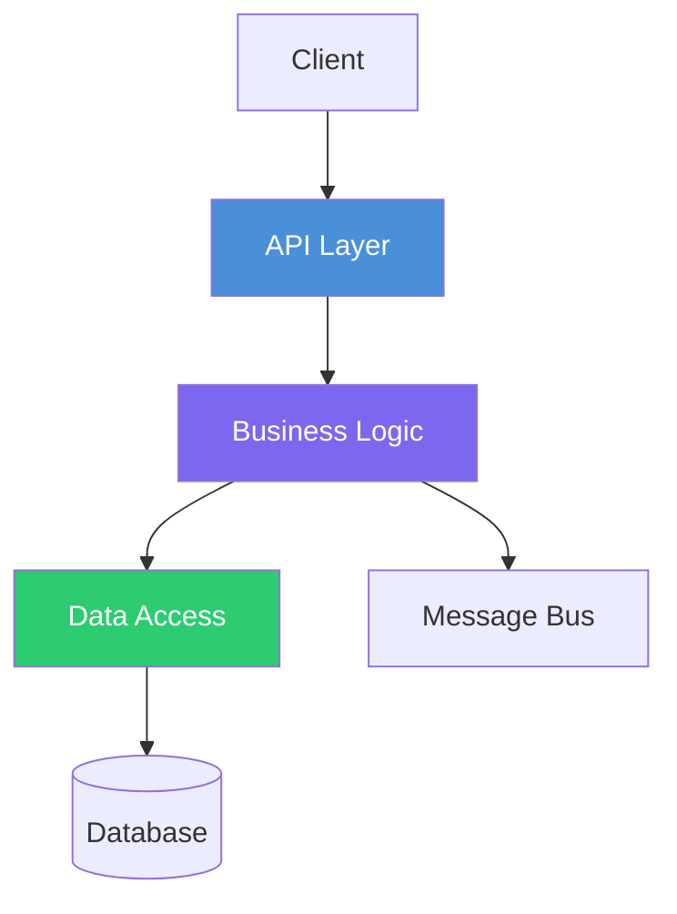

Generate **architecture.md** (P1-8) for the repository at `$input`.

## What to Analyze

1. **Project structure**: Folder layout, module organization, layer separation (controllers/services/repositories, Clean Architecture, Hexagonal, etc.)
2. **Design patterns**: Repository pattern, CQRS, Event Sourcing, MVC, Mediator, Strategy, Factory — identify from code structure
3. **Entry points**: Main method, startup class, request pipeline, middleware chain
4. **Internal components**: Major classes/modules, their responsibilities, how they interact
5. **Cross-cutting concerns**: Logging, error handling, authentication middleware, caching strategy
6. **Technology choices**: Why specific frameworks/libraries were chosen (infer from README, ADRs, comments)
7. **Architecture Decision Records**: Check for `docs/adr/`, `ARCHITECTURE.md`, or similar

## Output

Write to `architects-metadata/phase1/{repo-name}/architecture.md`

### Required Sections

1. **Overview** — One-paragraph summary of the architecture approach
2. **Architecture Style** — Identified pattern (layered, hexagonal, microservice, serverless, monolith)
3. **Component Diagram** — Mermaid `flowchart TD` showing internal components and their relationships
4. **Layer/Module Breakdown** — Per-layer: purpose, key classes, responsibilities
5. **Request Flow** — Mermaid `sequenceDiagram` showing a typical request through the system
6. **Design Patterns** — Table of patterns used, where they appear, and why
7. **Key Design Decisions** — Architecture decisions with context and rationale
8. **Technical Debt** — Known shortcuts, TODO items, areas needing refactoring (from code comments and issues)

### Component Diagram Format

## Validation

- Component diagram must reflect the actual folder/module structure
- Every major module should appear in the layer breakdown
- Design patterns claimed must be evidenced by code references
