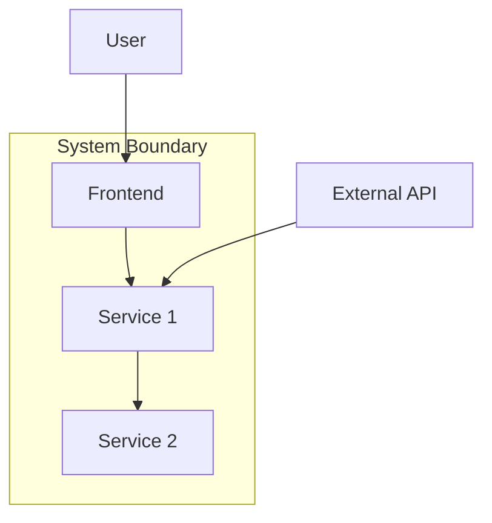

Synthesize a **System Architecture Overview** (P2-1) from Phase 1 artifacts.

## Prerequisites

Requires from `architects-metadata/phase1/`:
- **P1-1 repo-identity.yaml** from all repos (repo types, tech stacks)
- **P1-4 dependencies.yaml** from all repos (upstream/downstream relationships)
- **P1-8 architecture.md** from applicable repos (internal architecture details)
- **P1-10 domain-context.md** from applicable repos (bounded contexts)

## Synthesis Procedure

1. **Read all P1-1 files** → Build a system inventory (all repos, their types, tech stacks)
2. **Read all P1-4 files** → Build a system-wide dependency graph (services calling services)
3. **Read all P1-8 files** → Extract per-repo architecture styles and key decisions
4. **Read all P1-10 files** → Map bounded contexts and their relationships
5. **Synthesize**: Combine into a system-level view showing how all components fit together

## Output

Write to `architects-metadata/phase2/system-architecture.md`

### Required Sections

1. **System Overview** — High-level summary of the entire system (purpose, scale, key characteristics)
2. **System Context Diagram** — Mermaid `flowchart TD` showing the system boundary, external actors, and major subsystems

3. **Service Interaction Map** — Detailed diagram showing all services and their communication patterns (sync, async, data)
4. **Architecture Styles Inventory** — Table: repo → architecture style → key patterns
5. **Bounded Context Map** — System-wide context map showing all contexts and their relationships
6. **Technology Landscape Summary** — Aggregated tech stack across the system
7. **Cross-Cutting Architectural Decisions** — Decisions that span multiple repos
8. **Architecture Risks** — System-level risks identified from individual repo architectures

## Validation

- Every repo from P1-1 must appear somewhere in the system diagram
- Service relationships must be consistent with P1-4 dependency data
- No orphan services (every service connects to at least one other component)
