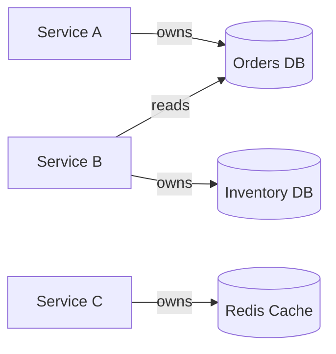

Synthesize a **Data Architecture** document (P2-4) from Phase 1 artifacts.

## Prerequisites

Requires from `architects-metadata/phase1/`:
- **P1-3 data-model.md** from service and pipeline repos
- **P1-4 dependencies.yaml** (infrastructure dependencies showing data stores)
- **P1-5 events.yaml** (data flowing through events)
- **P1-12 pipeline.yaml** (data processing pipelines)

## Synthesis Procedure

1. **Read all P1-3 files** → Inventory all data stores, entities, and ownership claims
2. **Read P1-4 infrastructure sections** → Map which services connect to which data stores
3. **Read P1-5 files** → Identify data flowing through events (eventual consistency patterns)
4. **Read P1-12 files** → Map ETL/data pipeline data flows
5. **Build data ownership map** → Which service owns (writes) vs. reads each data entity
6. **Identify shared data** → Databases accessed by multiple services, shared schemas
7. **Map data flows** → End-to-end data movement across the system

## Output

Write to `architects-metadata/phase2/data-architecture.md`

### Required Sections

1. **Data Landscape Summary** — Total data stores, technologies, data ownership model
2. **Data Store Inventory** — Table: store name → technology → owning service → consumers
3. **Data Ownership Map** — Which service is the system of record for which data

4. **Entity Relationship Overview** — System-wide ER diagram showing cross-service data relationships
5. **Data Flow Diagram** — How data moves through the system (API calls, events, batch, replication)
6. **Shared Data Patterns** — Shared databases, data replication, CQRS projections
7. **Event-Driven Data Flows** — Data propagated through events (from P1-5)
8. **Data Pipeline Flows** — ETL/batch data movement (from P1-12)
9. **Data Governance** — PII locations, retention policies, access controls
10. **Risks & Recommendations** — Shared databases, missing ownership, data consistency gaps

## Validation

- Every data store from P1-3 and P1-4 must appear in the inventory
- Ownership claims must not conflict (two services claiming write authority over same entity = flagged risk)
- Cross-references to P1 artifacts must be valid
