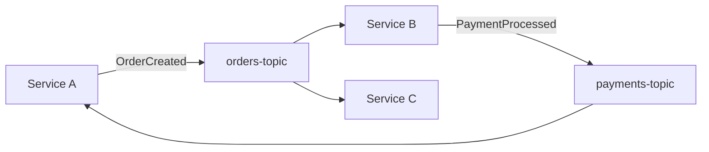

Synthesize an **Event Topology** document (P2-5) from Phase 1 artifacts.

## Prerequisites

Requires from `architects-metadata/phase1/`:
- **P1-5 events.yaml** from all repos using async messaging
- **P1-1 repo-identity.yaml** (for service identification)

## Synthesis Procedure

1. **Read all P1-5 files** → Collect all published and consumed events across the system
2. **Build event graph** → For each event: publisher → topic → consumer(s)
3. **Identify topology patterns** → Fan-out (one publisher, many consumers), fan-in (many publishers, one topic), event chains
4. **Map broker topology** → Which broker technology, topic namespaces, partitioning strategies
5. **Find orphans** → Events published but never consumed, or consumed but not published by any known service
6. **Assess reliability** → DLQ coverage, idempotency, retry policies across consumers

## Output

Write to `architects-metadata/phase2/event-topology.md`

### Required Sections

1. **Event Landscape Summary** — Total events, brokers, publishers, consumers
2. **Event Flow Diagram** — Mermaid diagram showing all event flows

3. **Event Registry** — Table: event name → publisher → topic → consumers → schema format
4. **Topic Ownership** — Which service owns each topic/exchange
5. **Consumer Group Mapping** — Consumer groups and their members
6. **Broker Topology** — Technologies used, clustering, partitioning strategy
7. **Event Chains** — Sequences of events that form workflows (saga patterns)
8. **Reliability Assessment** — DLQ coverage, idempotency, retry policies per consumer
9. **Orphaned Events** — Published events with no known consumers and vice versa
10. **Recommendations** — Schema standardization, naming conventions, missing DLQs, etc.

## Validation

- Every event from every P1-5 must appear in the registry
- Publisher-consumer relationships must be bidirectionally consistent
- Orphaned events must be explicitly flagged
