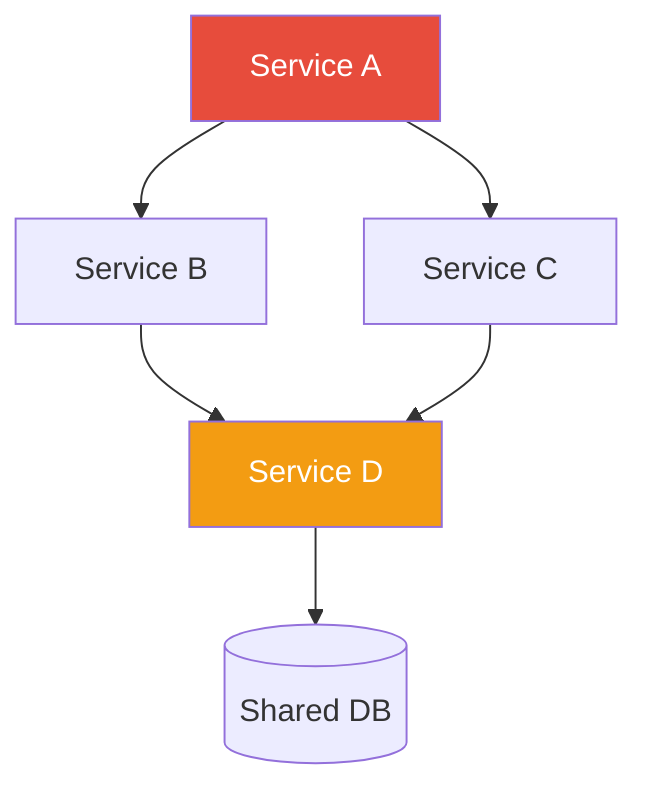

Synthesize a **Dependency Graph** (P2-6) from Phase 1 artifacts.

## Prerequisites

Requires from `architects-metadata/phase1/`:
- **P1-4 dependencies.yaml** from all repos (primary source)
- **P1-13 runtime-behavior.yaml** from deployed services (optional — for static vs. runtime diff)

## Synthesis Procedure

1. **Read all P1-4 files** → Build an adjacency list of all service-to-service dependencies
2. **Detect cycles** → Find circular dependency chains
3. **Compute blast radius** → For each service, calculate: if it goes down, what services are directly and transitively affected?
4. **Tier classification** → Tier 0 (critical path, most dependents), Tier 1, Tier 2 based on dependency count and criticality
5. **If P1-13 available** → Compare static dependencies (from code) vs. runtime dependencies (from telemetry) → surface undocumented calls
6. **Infrastructure dependencies** → Aggregate shared infrastructure (DBs, caches, brokers) and their consumers

## Output

Write to `architects-metadata/phase2/dependency-graph.md`

### Required Sections

1. **Dependency Summary** — Total services, total edges, density, max depth
2. **System Dependency Diagram** — Mermaid `flowchart TD` showing all services and dependencies

3. **Blast Radius Analysis** — Table: service → direct dependents → transitive dependents → blast radius score
4. **Criticality Tiers** — Tier 0/1/2 classification with criteria
5. **Cycle Detection** — Any circular dependency chains found
6. **Shared Infrastructure** — Databases, caches, brokers shared across multiple services
7. **Static vs. Runtime Diff** — Dependencies found in code but not in telemetry, and vice versa (if P1-13 data available)
8. **Risk Assessment** — Single points of failure, heavily depended-upon services, missing circuit breakers
9. **Recommendations** — Decouple cycles, add circuit breakers, reduce shared state

## Validation

- Every service from P1-4 must appear in the graph
- Dependency relationships must be bidirectionally verified (A depends on B → B should know about A as a consumer)
- Blast radius calculations must be mathematically consistent
