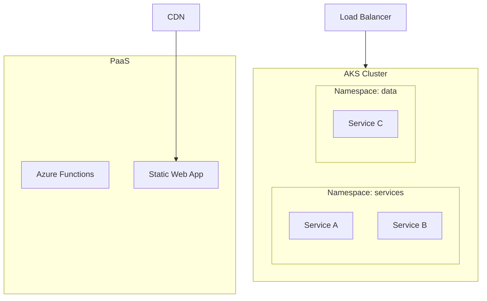

Synthesize an **Infrastructure Map** (P2-7) from Phase 1 artifacts.

## Prerequisites

Requires from `architects-metadata/phase1/`:
- **P1-7 deployment.yaml** from all deployable repos
- **P1-1 repo-identity.yaml** (for service identification)

## Synthesis Procedure

1. **Read all P1-7 files** → Inventory all hosting platforms, container configs, scaling rules
2. **Map infrastructure topology** → Which services run where, how they connect
3. **Aggregate resource allocations** → Total CPU/memory requested across the system
4. **Map networking** → Ingress, service mesh, load balancing, TLS termination
5. **Compare environments** → Dev vs. staging vs. production differences across services
6. **Identify patterns** → Common deployment patterns, outliers, inconsistencies

## Output

Write to `architects-metadata/phase2/infrastructure-map.md`

### Required Sections

1. **Infrastructure Summary** — Total services deployed, platforms used, environments
2. **Infrastructure Topology Diagram** — Mermaid diagram showing deployment topology

3. **Platform Distribution** — Table: platform → services → resource totals
4. **Container Registry** — Registries used, image naming conventions
5. **Scaling Configuration** — Per-service scaling rules, aggregate capacity
6. **Networking Topology** — Ingress, service mesh, internal vs. external communication
7. **Environment Matrix** — Differences across dev/staging/production for each service
8. **Resource Allocation Summary** — Total CPU/memory across the cluster
9. **Health Monitoring** — Health probe coverage across services
10. **Recommendations** — Inconsistent configs, missing health probes, over/under-provisioning

## Validation

- Every deployable repo with P1-7 must appear in the infrastructure map
- Resource totals must sum correctly from per-service allocations
- Environment differences must be explicitly documented
