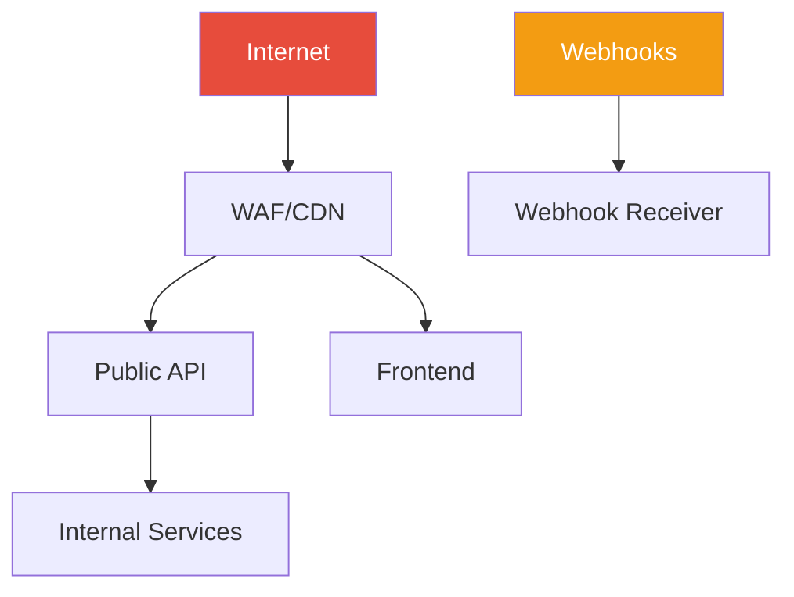

Synthesize a **Security Posture** document (P2-8) from Phase 1 artifacts.

## Prerequisites

Requires from `architects-metadata/phase1/`:
- **P1-9 security.yaml** from all repos
- **P1-2 api-summary.yaml** (endpoints that need protection)
- **P1-3 data-model.md** (PII and sensitive data locations)

## Synthesis Procedure

1. **Read all P1-9 files** → Aggregate auth mechanisms, authorization models, known risks
2. **Read P1-2 files** → Map all API endpoints and their auth requirements
3. **Read P1-3 files** → Identify PII locations and data protection controls
4. **Assess consistency** → Are all services using the same auth patterns? Are there gaps?
5. **Build risk registry** → Aggregate all known risks, assess system-level impact
6. **Map attack surface** → Public endpoints, external integrations, data ingress/egress points

## Output

Write to `architects-metadata/phase2/security-posture.md`

### Required Sections

1. **Security Summary** — Overall posture assessment (strong/moderate/weak) with key findings
2. **Authentication Landscape** — Auth mechanisms across the system, consistency analysis

| Service | Auth Mechanism | Identity Provider | Consistent? |
|---------|---------------|-------------------|-------------|

3. **Authorization Model** — RBAC roles and policies across the system
4. **API Security Coverage** — Endpoints with auth vs. without, public vs. internal
5. **Data Protection Overview** — Encryption at rest/in transit coverage, PII inventory
6. **Attack Surface Map** — Mermaid diagram showing external-facing surfaces

7. **Secret Management** — How secrets are managed across services, consistency
8. **Compliance Coverage** — Which frameworks are addressed, gaps
9. **Risk Registry** — Aggregated risks with severity, affected services, mitigations
10. **Recommendations** — Priority-ordered security improvements

## Validation

- Every service must have its auth configuration documented
- All PII locations from P1-3 must appear in the data protection section
- Risk severity must be consistent with impact scope
