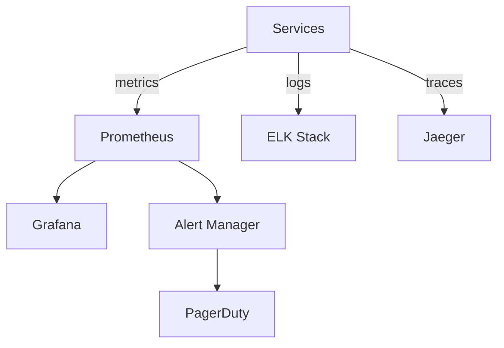

Synthesize an **Operational Handbook** (P2-9) from Phase 1 artifacts.

## Prerequisites

Requires from `architects-metadata/phase1/`:
- **P1-11 operations.yaml** from all deployed services
- **P1-13 runtime-behavior.yaml** (for SLO baselines and alert calibration)

## Synthesis Procedure

1. **Read all P1-11 files** → Aggregate monitoring platforms, alert rules, SLOs, runbooks
2. **Read P1-13 files** → Extract actual performance baselines for SLO calibration
3. **Build monitoring topology** → Which platforms monitor what, coverage gaps
4. **Compile alert playbook** → All alerts across the system, severity, response procedures
5. **Standardize SLOs** → Compare SLO targets across services, identify inconsistencies
6. **Map incident response** → On-call rotations, escalation paths, communication channels

## Output

Write to `architects-metadata/phase2/operational-handbook.md`

### Required Sections

1. **Operations Summary** — System-wide ops maturity assessment
2. **Monitoring Architecture** — Mermaid diagram showing monitoring platform topology

3. **Monitoring Coverage Matrix** — Table: service → metrics → logs → traces → alerts → health checks
4. **SLO Dashboard** — All SLOs across the system with targets and current performance
5. **Alert Playbook** — All alerts: name → severity → condition → response → owner
6. **Incident Response Workflow** — Mermaid `stateDiagram-v2` showing incident lifecycle
7. **On-Call & Escalation** — Rotation schedules, escalation paths, communication channels
8. **Runbook Index** — Aggregated list of all runbooks across services
9. **Observability Gaps** — Services missing monitoring, alerts, or health checks
10. **Recommendations** — Alerts to add, SLOs to adjust, monitoring gaps to fill

## Validation

- Every service with P1-11 must appear in the monitoring coverage matrix
- SLO targets must be realistic given P1-13 baseline data
- All alert rules must have a defined response procedure
