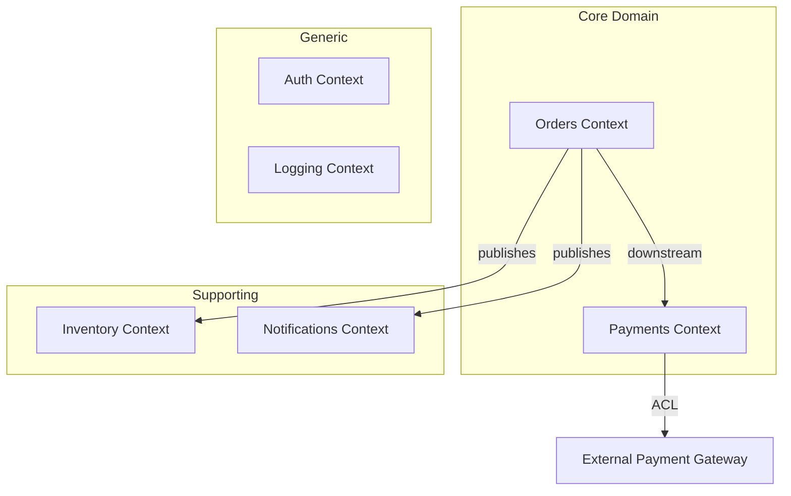

Synthesize a **Domain Map** (P2-10) from Phase 1 artifacts.

## Prerequisites

Requires from `architects-metadata/phase1/`:
- **P1-10 domain-context.md** from service, frontend, and pipeline repos

## Synthesis Procedure

1. **Read all P1-10 files** → Extract bounded contexts, ubiquitous language, context relationships
2. **Build context map** → All bounded contexts and their inter-relationships (upstream/downstream, conformist, ACL, shared kernel, partnership)
3. **Merge glossaries** → Combine ubiquitous language glossaries, flag term conflicts
4. **Map domain events flow** → Cross-context events from P1-10 domain events sections
5. **Identify subdomain classification** → Core, supporting, generic subdomains

## Output

Write to `architects-metadata/phase2/domain-map.md`

### Required Sections

1. **Domain Overview** — System-level domain description, business capabilities
2. **Context Map Diagram** — Mermaid diagram showing all bounded contexts and relationships

3. **Bounded Context Registry** — Table: context → owning repo(s) → subdomain type → description
4. **Context Relationship Matrix** — Detailed relationship types between all contexts
5. **Unified Glossary** — Merged ubiquitous language across all contexts
6. **Term Conflicts** — Same terms used differently across contexts
7. **Domain Event Flows** — Cross-context event chains
8. **Subdomain Classification** — Core vs. supporting vs. generic analysis
9. **Recommendations** — Misaligned boundaries, shared kernel risks, missing ACLs

## Validation

- Every P1-10 bounded context must appear in the context map
- Context relationships must be bidirectionally consistent
- Term conflicts must identify which context uses which definition
