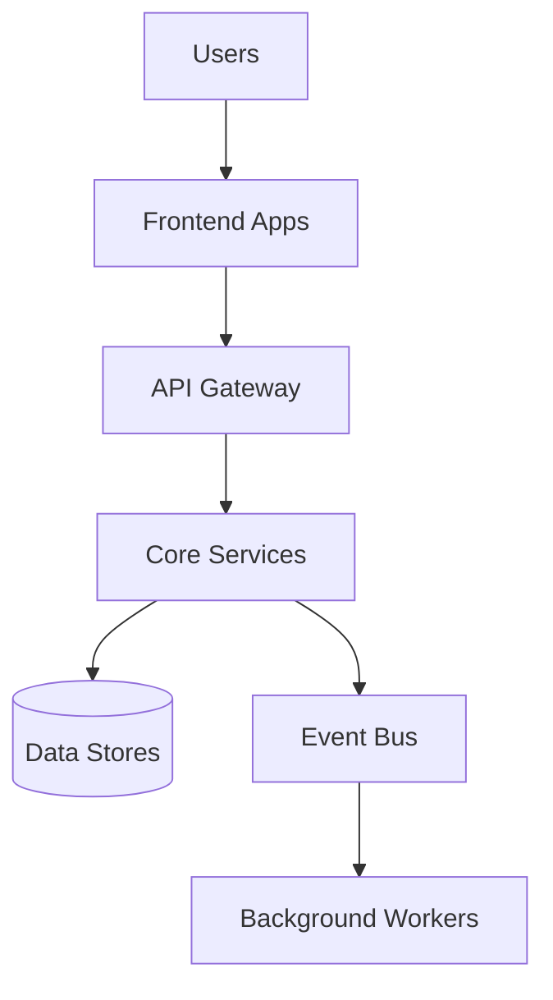

Synthesize an **Onboarding Guide** (P2-11) from Phase 1 and Phase 2 artifacts.

## Prerequisites

Requires from `architects-metadata/phase1/`:
- **P1-1 repo-identity.yaml** from all repos
- **P1-8 architecture.md** from key repos

Requires from `architects-metadata/phase2/`:
- **P2-1 system-architecture.md** (already generated)
- **P2-2 service-catalog.md/yaml** (already generated)

## Synthesis Procedure

1. **Read P2-1** → Extract system overview, key architectural concepts
2. **Read P2-2** → Get the full service catalog for orientation
3. **Read P1-1 and P1-8** → Identify key repos a new developer should understand first
4. **Build learning path** → Ordered sequence of things a new dev should learn, from most foundational to most specialized
5. **Identify quick-start repos** → Which repos have contribution guides, are well-documented, or are good starting points

## Output

Write to `architects-metadata/phase2/onboarding-guide.md`

### Required Sections

1. **Welcome & System Overview** — High-level system summary (simplified from P2-1)
2. **System Map for Newcomers** — Simplified Mermaid diagram (fewer details than P2-1)

3. **Team & Ownership Map** — Who owns what (simplified from P2-2)
4. **Getting Started Checklist** — Prerequisites, access requests, tools to install, repos to clone
5. **Key Workflows** — Most important user-facing workflows and which services they touch
6. **Learning Path** — Ordered learning sequence:
   - Week 1: System overview, core concepts
   - Week 2: Key service deep-dives
   - Week 3: Development workflow, CI/CD
   - Week 4: Specialized areas based on team assignment
7. **Common Tasks** — How to: run locally, run tests, deploy, check logs, respond to alerts
8. **Architecture Quick Reference** — Key patterns and decisions to understand
9. **Glossary** — Essential domain terms (curated from P2-10 if available)
10. **Useful Links** — Documentation, dashboards, communication channels

## Validation

- Guide should be understandable without deep technical knowledge
- All referenced repos must exist in P2-2 service catalog
- Learning path should follow a logical progression
