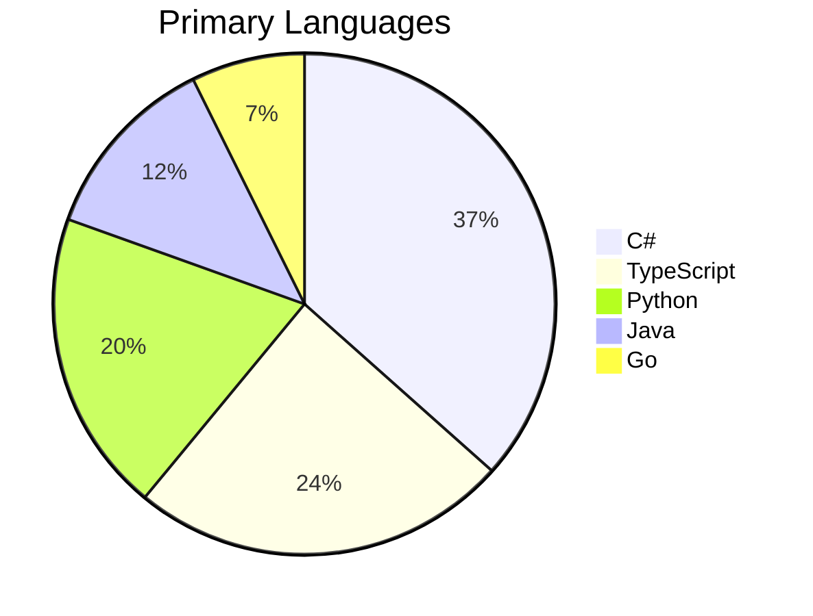

Synthesize a **Tech Landscape Report** (P2-12) from Phase 1 artifacts.

## Prerequisites

Requires from `architects-metadata/phase1/`:
- **P1-1 repo-identity.yaml** from all repos (tech-stack data)
- **P1-4 dependencies.yaml** from all repos (packages, shared libraries, build deps)
- **P1-7 deployment.yaml** from deployable repos (container images, platforms)

## Synthesis Procedure

1. **Read all P1-1 files** → Extract languages, frameworks, runtimes, build tools
2. **Read all P1-4 files** → Extract package dependencies, version ranges, shared libraries
3. **Read P1-7 files** → Extract deployment platforms, base images, CI tools
4. **Build technology census** → Count usage of each technology across repos
5. **Version distribution** → For key technologies, what versions are in use?
6. **Identify standardization opportunities** → Where multiple tools do the same thing
7. **Detect tech debt indicators** → Outdated versions, deprecated frameworks, unsupported runtimes

## Output

Write to `architects-metadata/phase2/tech-landscape.md`

### Required Sections

1. **Technology Summary** — Total unique languages, frameworks, platforms, packages
2. **Language Distribution** — Mermaid pie chart of primary languages

3. **Framework Census** — Table: framework → repos using it → version range → status
4. **Runtime Versions** — .NET, Node.js, Python, Java version distribution
5. **Package Dependency Analysis** — Most-used packages, critical shared dependencies
6. **Shared Library Adoption** — Internal libraries and their adoption across repos
7. **Deployment Platform Distribution** — Kubernetes vs. PaaS vs. serverless breakdown
8. **Build & CI Toolchain** — CI platforms, build tools, test frameworks
9. **Technology Radar** — Classify technologies into: Adopt, Trial, Assess, Hold
10. **Version Currency** — How many repos are on current vs. outdated versions
11. **Technical Debt Indicators** — Deprecated tech, unsupported versions, zombie dependencies
12. **Recommendations** — Standardize on X, upgrade Y repos to version Z, retire framework W

## Validation

- Technology counts must match the actual P1-1 data
- Version distributions must be accurate summations
- All recommendations must be tied to specific data findings
