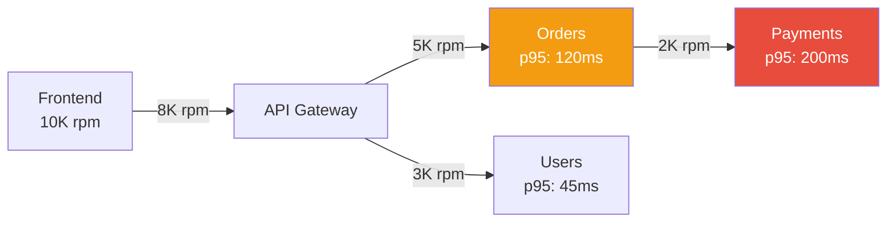

Synthesize a **System Runtime Profile** (P2-13) from Phase 1 artifacts.

## Prerequisites

Requires from `architects-metadata/phase1/`:
- **P1-13 runtime-behavior.yaml** from all deployed services

Use the `runtime-analysis` skill for detailed trace, log, and metrics interpretation procedures.

## Synthesis Procedure

1. **Read all P1-13 files** → Aggregate traffic, latency, error rates, resource utilization
2. **Build traffic flow map** → Request volumes between services (from dependency-calls)
3. **Construct latency chains** → End-to-end latency through service call chains
4. **Assess capacity** → Total resource utilization vs. allocated vs. available
5. **Baseline SLIs** → System-level SLI baselines from per-service data
6. **Identify bottlenecks** → Services with highest latency/error contribution to the overall system

## Output

Write to `architects-metadata/phase2/system-runtime-profile.md`

### Required Sections

1. **Runtime Summary** — System health snapshot: total requests, overall error rate, avg latency
2. **Traffic Flow Heatmap** — Mermaid diagram showing request volumes between services

3. **Latency Analysis** — Per-service latency (p50, p95, p99) ranked by impact
4. **Latency Chain Analysis** — End-to-end latency breakdown for key user journeys
5. **Error Rate Distribution** — Error rates across services, top error types
6. **Resource Utilization Overview** — CPU/memory utilization across the system
7. **Capacity Planning** — Current usage vs. limits, growth projections
8. **Scaling Behavior** — Auto-scaling patterns, trigger frequency, time-to-scale
9. **System SLI Baselines** — Aggregated SLIs for the system
10. **Bottleneck Assessment** — Services contributing most to latency/errors
11. **Availability Report** — Uptime across services, incident frequency
12. **Recommendations** — Performance improvements, capacity adjustments, scaling policy changes

## Validation

- All services with P1-13 data must appear in the analysis
- Traffic volumes at consumers must be ≤ traffic from producers (accounting for fanout)
- Latency chain totals must be consistent with per-service p95 values
- If P1-13 data is unavailable for some services, note the gaps clearly
