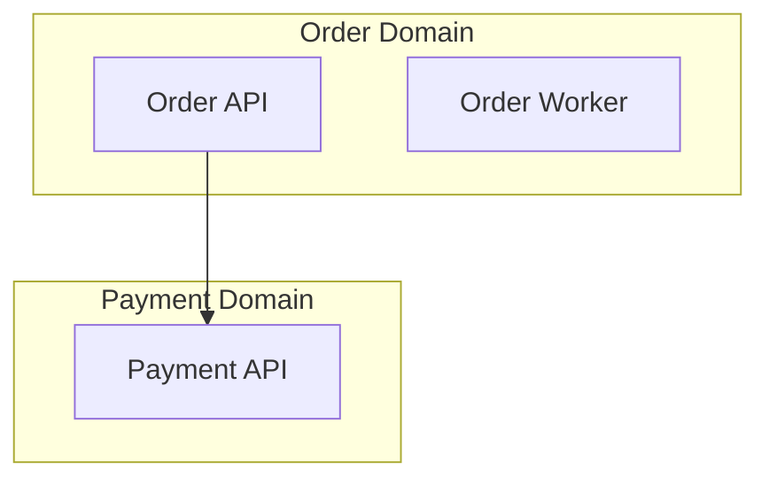
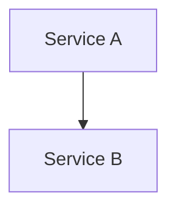

# Mermaid Diagram Conventions

Any diagrams should be created using Mermaid syntax and follow the conventions outlined below to ensure consistency across documentation. These guidelines cover diagram type selection, styling rules, size guidelines, and Markdown integration.

## Diagram Type Selection

| Documentation Context | Mermaid Diagram Type | Use For |
|---|---|---|
| System/service architecture | `flowchart TD` | Service relationships, request flows, component layout |
| Data models / ERDs | `erDiagram` | Entity relationships, database schemas |
| Request/event flows | `sequenceDiagram` | Service-to-service call sequences, async message flows |
| Deployment topology | `flowchart LR` | Infrastructure layout, network topology |
| Domain boundaries | `flowchart TD` with `subgraph` | Bounded contexts, domain groupings |
| State machines | `stateDiagram-v2` | Workflow states, pipeline stages |
| Dependency graphs | `flowchart TD` | Service dependency trees, blast radius |

## Styling Rules

### Node Naming
- Use `PascalCase` for service/component names: `OrderService`, `PaymentGateway`
- Include the repo name in parentheses for cross-repo references: `OrderService(order-svc)`
- Use short, descriptive labels — max 30 characters

### Subgraph Grouping
Group by:
- **Bounded context / domain** in architecture diagrams
- **Environment** in deployment diagrams (dev, staging, prod)
- **Technology layer** in stack diagrams (frontend, backend, data, infra)



### Edge Labels
- Always label edges with the interaction type: HTTP, gRPC, async, event, SQL
- For async messaging, use dotted lines: `-.->` or `-. "event" .->`
- For sync calls, use solid lines: `-->` or `-- "REST" -->`

### Color Coding (CSS classes)
Use consistent colors when styling is needed:
- `classDef service fill:#4A90D9,color:#fff` — Backend services
- `classDef frontend fill:#7B68EE,color:#fff` — Frontend apps
- `classDef database fill:#2ECC71,color:#fff` — Databases
- `classDef queue fill:#F39C12,color:#fff` — Message queues/brokers
- `classDef external fill:#95A5A6,color:#fff` — External/third-party systems

## Size Guidelines

- **Per-repo diagrams** (P1 artifacts): Max 15-20 nodes. Focus on internal components.
- **System-level diagrams** (P2 artifacts): Max 40-50 nodes. Use subgraph grouping to manage complexity. Create multiple focused diagrams rather than one massive diagram.
- If a diagram exceeds 50 nodes, split into:
  1. A high-level overview (domains/layers only)
  2. Detailed per-domain or per-layer views

## Markdown Integration

Always place Mermaid diagrams inside fenced code blocks with the `mermaid` language tag:

````

````

Include a brief text description before each diagram explaining what it shows.
