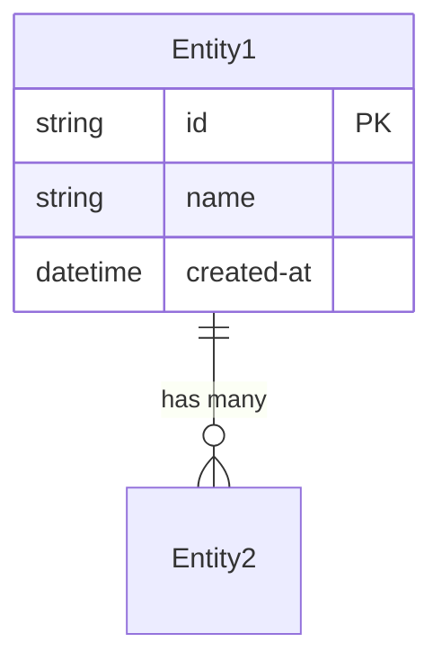

Generate **data-model.md** (P1-3) for the repository at `$input`.

## Applicability

This artifact applies to repos classified as `service` or `pipeline` that interact with persistent data stores. Skip for repos with no database schemas, migrations, or ORM models.

## What to Analyze

1. **ORM models / entity classes**: EF Core DbContext, Hibernate entities, Sequelize models, SQLAlchemy models, Prisma schemas
2. **Database migrations**: Migration files showing schema evolution (EF Migrations, Flyway, Alembic, Knex)
3. **Raw SQL / DDL**: Schema creation scripts, stored procedures
4. **Data stores**: Identify all databases (SQL, NoSQL, Redis, Elasticsearch, blob storage)
5. **Relationships**: Foreign keys, navigation properties, join tables, references between entities
6. **Data ownership**: Which entities does this repo own vs. consume from other services?

## Output

Write to `architects-metadata/phase1/{repo-name}/data-model.md`

### Required Sections

1. **Data Store Inventory** — Table listing each data store (type, technology, purpose)
2. **Entity Catalog** — List of all entities/tables with descriptions and key fields
3. **ER Diagram** — Mermaid `erDiagram` showing entities and relationships
4. **Schema Details** — Per-entity: fields, types, constraints, indexes
5. **Migration History** — Key schema changes over time (summarized from migration files)
6. **Data Ownership** — Which entities are owned (write authority) vs. consumed (read-only/replicated)
7. **Data Flows** — How data enters and exits this repo (APIs, events, batch jobs)

### ER Diagram Format

## Validation

- Every entity class in code must appear in the entity catalog
- ER diagram must include all entities and their relationships
- Data store inventory must list all connection strings/configs found (names only, no credentials)
