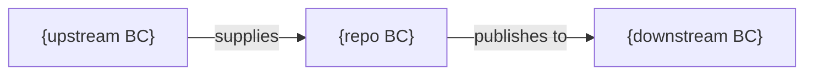

Generate **domain-context.md** (P1-10) for the repository at `$input`.

## Applicability

This artifact is most valuable for `service`, `frontend`, and `pipeline` repos. It may be minimal for `library` and `iac` repos.

## What to Analyze

1. **Domain entities**: Key business objects, their properties and behaviors
2. **Bounded context**: What domain scope does this repo own? What are its boundaries?
3. **Ubiquitous language**: Domain-specific terms used in code, their business meanings
4. **Aggregates**: Root entities that form consistency boundaries
5. **Domain events**: Business events that cross bounded context boundaries
6. **Context relationships**: How this context relates to others (upstream/downstream, conformist, anti-corruption layer, shared kernel)
7. **Business rules**: Validation rules, invariants, policies encoded in the domain layer

## Output

Write to `architects-metadata/phase1/{repo-name}/domain-context.md`

### Required Sections

1. **Bounded Context Summary** — Name, purpose, scope in one paragraph
2. **Ubiquitous Language Glossary** — Table of domain terms with definitions

| Term | Definition | Code Representation |
|------|-----------|-------------------|
| {term} | {business meaning} | `{ClassName or field}` |

3. **Aggregate Map** — List of aggregates with their root entity and child entities
4. **Domain Model Diagram** — Mermaid `classDiagram` or `flowchart` showing key domain entities and relationships
5. **Context Map** — How this bounded context relates to other contexts in the system

6. **Business Rules** — Key domain rules and invariants encoded in the codebase
7. **Domain Events** — Events that represent important state changes in this context

## Validation

- Glossary terms should match actual class/variable names in code
- Context relationships should be consistent with P1-4 dependencies
- Domain events should be consistent with P1-5 events catalog
